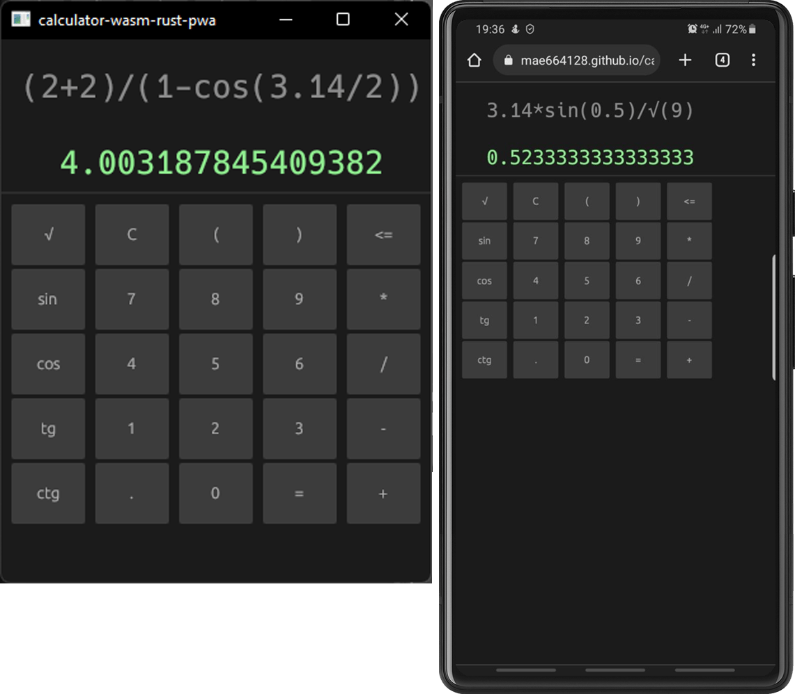
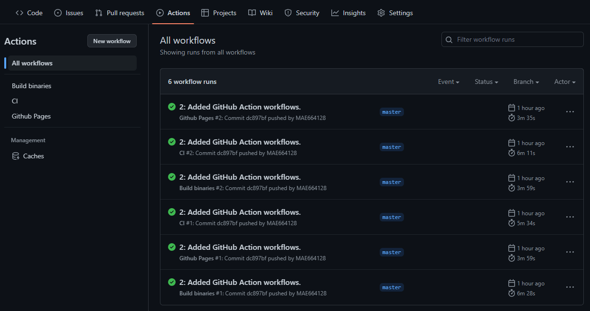
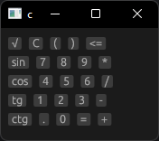
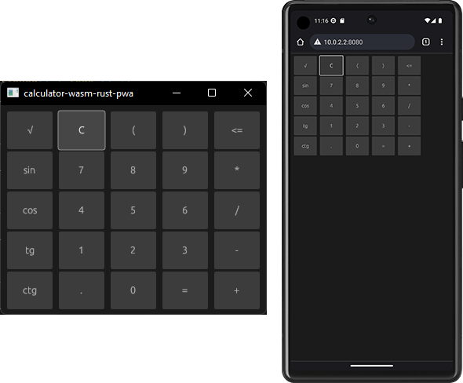

下面将展示如何编写[PWA](https://en.wikipedia.org/wiki/Progressive_web_app)应用程序的示例，旨在在浏览器和Windows操作系统计算机上均可使用。我们将使用Rust编程语言和eframe框架([egui](https://github.com/emilk/egui#quick-start))。完成的应用程序将作为Windows操作系统的可执行文件和Webassembly文件提供。在开发过程中，我们将使用GitHub Action来监控我们代码的正确性并构建可执行程序文件，同时使用Webassembly部署应用程序版本作为网页(GitHub Pages)。



## 作者的动机

在工作之余，我经常会花时间研究不同编程语言及其生态系统。最近，我将注意力转向了Rust编程语言。在继续了解Rust生态系统的过程中，我开始研究用于构建用户图形界面的工具。不得不说，我感到非常惊讶，无论是正面还是负面。

令人欣喜的是：

- 有非常[多](https://www.areweguiyet.com/)的用于创建GUI的库和框架可供选择，有些完全使用Rust编写，有些则是对其他语言工具的封装；
- 其中许多可用于跨平台开发，包括将应用程序编译为 [WASM](https://en.wikipedia.org/wiki/WebAssembly) 并将其发布为网页的功能。

令人沮丧的是：

- 同样，有很多用于创建GUI的库和框架，几乎所有这些库都声称尚不可用，并且仍处于实验阶段（例如，[Druid](https://github.com/linebender/druid) 项目，其主要团队已经停止开发并专注于新项目 [Xilem](https://github.com/linebender/xilem)。是的，这个新项目也还不稳定。

最吸引我注意的是可以将应用程序编译为 [WASM](https://en.wikipedia.org/wiki/WebAssembly) 并将其发布为网页的功能。我想，“这是明天或昨天的趋势”，无论如何都应该关注这个方向（稍微有些虚假，因为一两年前我曾尝试使用Rust + [Yew](https://github.com/yewstack/yew) 创建 [海战游戏](https://mae664128.github.io/sea_battle/) ）。

尽管有许多用于开发用户界面的工具可供选择，但我的选择是[EGUI](https://github.com/emilk/egui#quick-start)。并不是因为我进行了深入研究，制作了表格，权衡了利弊，而是因为我被这个[示例](https://www.egui.rs/#demo)所吸引。

1. ## 工作计划

   1. 确定最低要求集（我们想要什么）。
   2. 准备并解析应用程序模板。
   3. 准备GitHub Actions，以便自动构建和发布我们的成果。
   4. 开发简单界面。
   5. 为我们的问题开发简单的求解器。

## 结果要求

在所有工作完成后，希望获得一个可用的计算器界面，可作为网络页面（PWA）在互联网上访问，也可作为Windows操作系统的可执行文件使用。

*为什么是计算器？*
*偶然看到了有关[逆波兰表示法](#逆波兰表示法)的文章，阅读后决定尝试实现它。而且，至少我已经知道如何计算2 + 2，为什么不试着做一个相应的图形界面呢。*

在这个过程中，我希望专注于最重要的事情 - 开发，而不是将时间花在部署应用程序到互联网上和将已构建的可执行文件发布到公共访问。因此，首先，我们将创建一个简单的项目模板，并设置（基本）CI/CD，使用GitHub Action和GitHub Pages。

## 1 准备模板

### 1.1 初始化项目

在开始之前，确保已安装了 Rust。

```bash
$ rustup --version
rustup 1.25.2 (17db695f1 2023-02-01)
info: This is the version for the rustup toolchain manager, not the rustc compiler.
info: The currently active `rustc` version is `rustc 1.67.1 (d5a82bbd2 2023-02-07)`
```

我们通过运行 `cargo new <project-name>` 命令来创建一个新项目：

```bash
$ cargo new calculator-wasm-rust-pwa --bin
     Created binary (application) `calculator-wasm-rust-pwa` package
```

由于我们想要一个可执行文件而不是库，所以我们使用了 `--bin` 标记。

让我们还在项目中添加一个 `src/lib.rs` 文件：

```bash
$ touch calculator-wasm-rust-pwa/src/lib.rs
```

让我们看一下 Cargo 为我们生成了什么：

```bash
$ cd calculator-wasm-rust-pwa/
$ tree .
.
├── .gitignore
├── Cargo.toml
└── src
    └── main.rs
```

`Cargo.toml` 文件中包含了关于我们项目的所有信息，包括我们项目所需的所有包（依赖项）的列表。我们将在 `src\` 文件夹中放置我们的代码。

### 1.2 向项目添加必要的依赖项

由于我们选择了 [EGUI](https://github.com/emilk/egui#quick-start)，并且我们希望编写一个可以在互联网和本地运行的应用程序，因此首先添加 `eframe` - 这是使用 egui 编写应用程序的官方框架库。

```bash
$ cargo add eframe --no-default-features -F default_fonts -F glow -F persistence
```

对于添加 eframe 的说明：
	- `default_fonts` - 允许我们将 egui 的默认字体添加到项目中。
	- `glow` - 告诉 egui 使用 glow 作为渲染后端。其他选择包括："wgpu"。
	- `persistence` - 允许我们实现应用程序重启后状态的恢复。

暂时就这些。最终，我们的 Cargo.toml 文件看起来像这样：

```toml
# ./Cargo.toml

[package]
version = "0.1.0"
name = "calculator-wasm-rust-pwa"
description = "A simple calculator created to demonstrate how to work with web gui on rust."
authors = ["Matkin Alexandr <mae664128@gmail.com>"]
edition = "2021"
rust-version = "1.67.1"

[dependencies]
eframe = { version = "0.21.3", default-features = false, features = ["default_fonts", "glow", "persistence"] }

[profile.release]
opt-level = 2 # fast and small wasm
codegen-units = 1
lto = true
panic = "abort"

# Optimize all dependencies even in debug builds:
[profile.dev.package."*"]
opt-level = 2
```

你可能注意到我的 Cargo.toml 文件中有一些额外的部分，你可能没有。如果你不知道它们的作用，并且不确定它们是否适用于你，一定要阅读 [The Manifest Format - The Cargo Book](https://doc.rust-lang.org/cargo/reference/manifest.html) 中关于它们的内容。

### 1.3 编写我们的第一个界面代码

借助于 [eframe 文档](https://docs.rs/eframe/latest/eframe/) 中的示例，稍作修改，尝试编写带有我们第一个界面的代码。

首先，让我们按以下方式编辑 `./src/main.rs` 文件：

```rust
// ./src/main.rs
#![cfg_attr(not(debug_assertions), windows_subsystem = "windows")] // hide console window on Windows in release

use eframe::egui;

fn main() -> eframe::Result<()> {
    eframe::run_native(
        "calculator-wasm-rust-pwa",
        eframe::NativeOptions::default(),
        Box::new(|cc| Box::new(CalcApp::new(cc))),
    )
}

struct CalcApp {}

impl CalcApp {
    fn new(_cc: &eframe::CreationContext<'_>) -> Self {
        CalcApp {}
    }
}

impl eframe::App for CalcApp {
    fn update(&mut self, ctx: &egui::Context, _frame: &mut eframe::Frame) {
        egui::CentralPanel::default().show(ctx, |ui| {
            ui.label(r#"
            This is a fictional calculator.

To use the calculator, you need to use your imagination. Imagine any interface, type a mathematical expression in it, and press '='.
See the result, right? - Congratulations, your calculator works well.
            "#);
        });
    }
}
```

在继续之前，让我们先澄清一下这里的代码。我们应用程序的起点是 `main()` 函数。

```rust
// ./src/main.rs
// ... 
fn main() -> eframe::Result<()> {
    eframe::run_native(
        "calculator-wasm-rust-pwa",
        eframe::NativeOptions::default(),
        Box::new(|cc| Box::new(CalcApp::new(cc))),
    )
}
// ...
```

通过使用 `eframe::run_native` 函数，我们将运行我们自己的（本地）应用程序。该函数接受以下参数：

- `app_name`（第一行） - 这是我们应用程序的名称。它将用作本机窗口标题栏的字符串。
- `native_options`（第二行） - 这是 `NativeOptions` 结构，用于控制本机窗口的行为。我们稍后会再提及如何配置我们的应用程序，但现在我们将使用 `eframe::NativeOptions::default()` 实现的默认配置。
- `app_creator`（第三行） - 在这里你创建你的应用程序。

我们已经将我们编写的 `CalcApp::new(cc)` 结构指定为 app_creator，该结构实现了 `eframe::App` trait。

```rust
// ./src/main.rs
// ... 
struct CalcApp {}

impl CalcApp {
    fn new(_cc: &eframe::CreationContext<'_>) -> Self {
        CalcApp {}
    }
}

impl eframe::App for CalcApp {
    fn update(&mut self, ctx: &egui::Context, _frame: &mut eframe::Frame) {
        egui::CentralPanel::default().show(ctx, |ui| {
            ui.label(r#"
            This is a fictional calculator.

To use the calculator, you need to use your imagination. Imagine any interface, type a mathematical expression in it, and press '='.
See the result, right? - Congratulations, your calculator works well.
            "#);
        });
    }
}
```

我们创建了一个空的 `CalcApp` 结构，并实现了 `new()` 函数，该函数在第一帧之前被调用一次。接下来，我们将初始化我们应用程序的参数。
最重要的函数是我们开始构建我们界面的 `update` 函数，它来自 `eframe::App` trait。该函数将在需要重新绘制用户界面时调用，这可能每秒发生多次。在该函数内部，我们将在 `SidePanel`、`TopPanel`、`CentralPanel`、`Window` 或 `Area` 中放置我们的小部件。

尝试运行我们的应用程序：

```bash
$ cargo run
```

完成了。计算器已经准备就绪。解散吧。


现在我们的应用程序已经构建并运行了，如果我们执行以下命令，我们可以获得可执行文件：

```bash
$ cargo build --release
```

然而，获得可执行文件只完成了目标的一半。我们希望能够将我们的应用程序构建为一组文件，以便可以在互联网上部署。我们需要解决这个问题。


### 1.4 通过添加 Wasm 编译能力来修改代码

#### 1.4.1 安装 Trunk

我们将使用 [Trunk](https://trunkrs.dev/) 将我们的应用程序构建为 Wasm 文件。

通过以下命令安装 Trunk：

```bash
$ cargo install --locked trunk
```

但是，如果你尝试构建应用程序并使用开发服务器运行它：

```bash
$ trunk serve
```

你会遇到一些错误，告诉我们我们的项目还没有准备好。让我们解决这个问题。

#### 1.4.2 创建 index.html 文件和其他文件

首先，我们需要创建 `index.html` 文件。让我们使用此[示例](https://github.com/emilk/eframe_template/)中准备的文件，并根据自己的需要进行修改。将 `index.html` 和 `assets\` 目录复制到我们的项目中，使得项目的目录结构如下：

```bash
$ cd calculator-wasm-rust-pwa/
$ tree .
H:.
│   .gitignore
│   Cargo.toml
│   index.html
├───assets\
│       favicon.ico
│       icon-1024.png
│       icon-256.png
│       icon_ios_touch_192.png
│       manifest.json
│       maskable_icon_x512.png
│       sw.js
└───src\
        main.rs
```

我不会详细解释 `index.html` 和 `sw.js` 文件的特性，但在继续之前，请确保查阅 [Trunk 文档](https://trunkrs.dev/) 和 Service Workers 的使用方法。

#### 1.4.3 生成 favicon.ico

这很简单。我们进入 [stable diffusion web](https://stablediffusionweb.com/#demo) 并生成一张图片，我们将使用它来创建图标 - `favicon.ico`。


#### 1.4.4 修改 main.rs 代码以便进行 Wasm 编译

如果我们尝试使用以下命令将我们的应用程序编译为 Wasm：

```bash
$ trunk build
```

我们将会遇到编译错误：

```bash
error[E0433]: failed to resolve: could not find `NativeOptions` in `eframe`                                                  
  --> src\main.rs:8:17
   |
 8 |         eframe::NativeOptions::default(),
   |                 ^^^^^^^^^^^^^ could not find `NativeOptions` in `eframe`

error[E0425]: cannot find function `run_native` in crate `eframe`
  --> src\main.rs:6:13
   |
 6 |     eframe::run_native(
   |             ^^^^^^^^^^ not found in `eframe`

一些错误有详细的解释：E0425, E0433。

编译器告诉我们在 `eframe` 中找不到 `run_native()`。但这不可能，因为当我们使用 `cargo run` 命令时，这段代码已经能够正常工作了。

问题在于这一[行](https://github.com/emilk/egui/blob/master/crates/eframe/src/lib.rs#L181)：

```rust
#[cfg(not(target_arch = "wasm32"))]
```

位于 `run_native()` 函数的注解之前。您可以在 [Rust 🦀 and WebAssembly](https://rustwasm.github.io/docs/book/reference/add-wasm-support-to-crate.html#maybe-your-crate-already-supports-webassembly) 文档中详细了解此行的含义，以及在 Rust 中使用 Wasm 的编译特性。

让我们修改我们的 `./src/main.rs` 文件。

```rust
// ./src/main.rs
// ... 

// 在函数注解之前添加了一行新代码
#[cfg(not(target_arch = "wasm32"))]  
fn main() -> eframe::Result<()>  { ... }  

// 为了使用 trunk 编译，我们添加了 main() 函数。
#[cfg(target_arch = "wasm32")]
fn main() {  
    // 确保 panic 通过 `console.error` 注册。
    console_error_panic_hook::set_once();  
    wasm_bindgen_futures::spawn_local(async {  
        eframe::start_web(  
            "calculator-wasm-rust-pwa",  
            eframe::WebOptions::default(),  
            Box::new(|cc| Box::new(CalcApp::new(cc))),  
        )  
            .await  
            .expect("failed to start calculator-wasm-rust-pwa");  
    });  
}
// ...

```

请注意，我们的 `CalcApp::new()` 应用程序保持不变。我们使用相同的代码在本机应用程序和 Web 中运行。

请仔细查看新代码。`eframe::start_web()` 中传递的参数与 `eframe::run_native()` 相似。

在这段代码中，我们使用了两个新的 crate 的函数调用:

- `console_error_panic_hook` - 允许调试 `wasm32-unknown-unknown` 中的 panic，提供 panic 捕获器。`console_error_panic_hook::set_once()` 将 panic 消息重定向到 `console.error`。
- `wasm_bindgen_futures` - 提供了将 JavaScript 的 Promise 类型作为 Rust Future 使用的桥梁。`spawn_local` 函数在当前线程中运行 Rust Future。

为了使我们的代码工作，让我们在 `./Cargo.toml` 文件中添加所需的依赖项:

```toml
# ...
# web:  
[target.'cfg(target_arch = "wasm32")'.dependencies]  
console_error_panic_hook = "0.1.7"  
tracing-wasm = "0.2"  
wasm-bindgen-futures = "0.4"
# ...
```

现在，如果我们运行提供 trunk 的开发服务器:

```bash
$ trunk serve
```

我们可以确保一切正常，并通过浏览器访问地址 http://127.0.0.1:8080:

```bash
$ trunk serve

Compiling calculator-wasm-rust-pwa v0.1.0 (H:\GOOGLE_20220408\DEVELOPER\calculator-wasm-rust-pwa)
    Finished dev [unoptimized + debuginfo] target(s) in 3.61s                                                                                    
2023-02-25T13:11:15.732104Z  INFO fetching cargo artifacts
2023-02-25T13:11:16.009440Z  INFO processing WASM for calculator-wasm-rust-pwa
2023-02-25T13:11:16.210436Z  INFO calling wasm-bindgen for calculator-wasm-rust-pwa
2023-02-25T13:11:16.542757Z  INFO copying generated wasm-bindgen artifacts
2023-02-25T13:11:16.578580Z  INFO applying new distribution
2023-02-25T13:11:16.582748Z  INFO  success
2023-02-25T13:11:16.587400Z  INFO  serving static assets at -> /
2023-02-25T13:11:16.588514Z  INFO  server listening at http://127.0.0.1:8080


```


当我们在项目目录中运行 trunk dev server 时，将会生成一个 `dist/` 文件夹，其中包含了用于部署到服务器上的文件集合。

## 2. 配置 GitHub Action

在继续之前，让我们总结一下我们所拥有的内容：

- 通过运行`cagro build --release`命令，我们将获得我们应用程序的可执行文件
- 通过运行`trunk build --release`命令，我们将获得一组文件，包括`index.html`，这些文件已经准备好放置在我们的公共服务器上。

接下来，让我们尝试将我们的 Web 应用程序文件放置在 GitHub 页面上。为了避免每次手动执行此操作，我们将使用 GitHub Actions。

GitHub 已经为 Rust 语言准备了一些预先配置的 yml 文件，但我们不打算使用它们。相反，我们将使用与[示例](https://github.com/emilk/eframe_template/)相同的示例，其中包括图标和`index.html`文件。

在我们项目的根目录下，让我们创建一个名为`.github/workflows/`的文件夹，并在其中创建三个文件：

- `rust.yml` - 在此文件中，我们将配置我们的 CI，它将负责执行以下任务：
  - 作业: 检查：- 执行`cargo check`命令，用于检查本地包及其所有依赖项是否存在错误。
  - 作业: 检查_wasm：执行`cargo check --all-features --lib --target wasm32-unknown-unknown`命令，其本质上类似于前一个命令，但是针对检查 wasm32-unknown-unknown 目标三元组。
  - 作业: 测试：- 使用`cargo test --lib`命令运行我们的测试，不需要任何说明。
  - 作业: Clippy：- 使用 Rust 中非常流行的代码检查工具 - [clippy](https://github.com/rust-lang/rust-clippy)。此作业内部将运行`cargo clippy`命令。
  - 作业: Trunk：- 尝试为 wasm32-unknown-unknown 目标构建项目，与之前的操作类似。
- `pages.yml` - 在此文件中，我们将再次使用 Trunk，并使用命令`trunk build --release --public-url "${GITHUB_REPOSITORY#*/}"`来收集我们的所有文件，并将它们放置在我们存储库的`gh-pages`分支中。
- `build_binaries.yml` - 将负责为 Windows 系统构建可执行文件。完成的可执行文件将作为构建的一部分附加到存档中。

<details>
  <summary>Содержимое файла rust.yml:</summary>

	```yml
	# .github/workflows/rust.yml
	
	on: [push, pull_request]  
	  
	name: CI  
	  
	env:  
	  # This is required to enable the web_sys clipboard API which egui_web uses  
	  # https://rustwasm.github.io/wasm-bindgen/api/web_sys/struct.Clipboard.html  # https://rustwasm.github.io/docs/wasm-bindgen/web-sys/unstable-apis.html  RUSTFLAGS: --cfg=web_sys_unstable_apis  
	  
	jobs:  
	  check:  
	    name: Check  
	    runs-on: ubuntu-latest  
	    steps:  
	      - uses: actions/checkout@v3  
	      - uses: actions-rs/toolchain@v1  
	        with:  
	          profile: minimal  
	          toolchain: stable  
	          override: true  
	      - uses: actions-rs/cargo@v1  
	        with:  
	          command: check  
	          args: --all-features  
	  
	  check_wasm:  
	    name: Check wasm32  
	    runs-on: ubuntu-latest  
	    steps:  
	      - uses: actions/checkout@v3  
	      - uses: actions-rs/toolchain@v1  
	        with:  
	          profile: minimal  
	          toolchain: stable  
	          target: wasm32-unknown-unknown  
	          override: true  
	      - uses: actions-rs/cargo@v1  
	        with:  
	          command: check  
	          args: --all-features --lib --target wasm32-unknown-unknown  
	  
	  test:  
	    name: Test  
	    runs-on: ubuntu-latest  
	    steps:  
	      - uses: actions/checkout@v3  
	      - uses: actions-rs/toolchain@v1  
	        with:  
	          profile: minimal  
	          toolchain: stable  
	          override: true  
	      - run: sudo apt-get install libxcb-render0-dev libxcb-shape0-dev libxcb-xfixes0-dev libxkbcommon-dev libssl-dev  
	      - uses: actions-rs/cargo@v1  
	        with:  
	          command: test  
	          args: --lib  


​	  
	  clippy:  
	    name: Clippy  
	    runs-on: ubuntu-latest  
	    steps:  
	      - uses: actions/checkout@v3  
	      - uses: actions-rs/toolchain@v1  
	        with:  
	          profile: minimal  
	          toolchain: stable  
	          override: true  
	          components: clippy  
	      - uses: actions-rs/cargo@v1  
	        with:  
	          command: clippy  
	          args: -- -D warnings  
	  
	  trunk:  
	    name: trunk  
	    runs-on: ubuntu-latest  
	    steps:  
	      - uses: actions/checkout@v3  
	      - uses: actions-rs/toolchain@v1  
	        with:  
	          profile: minimal  
	          toolchain: stable  
	          target: wasm32-unknown-unknown  
	          override: true  
	      - name: Rust Cache # cache the rust build artefacts  
	        uses: Swatinem/rust-cache@v1  
	      - name: Download and install Trunk binary  
	        run: wget -qO- https://github.com/thedodd/trunk/releases/latest/download/trunk-x86_64-unknown-linux-gnu.tar.gz | tar -xzf-  
	      - name: Build  
	        run: ./trunk build
	```
</details>

<details>
  <summary>Содержимое файла pages.yml:</summary>

	```yml
	# .github/workflows/pages.yml
	
	name: Github Pages  
	  
	# By default, runs if you push to master. keeps your deployed app in sync with master branch.  
	on:  
	  push:  
	    branches:  
	      - master  
	# to only run when you do a new github release, comment out above part and uncomment the below trigger.  
	# on:  
	#   release:  
	#     types:  
	#       - published  
	  
	permissions:  
	  contents: write # for committing to gh-pages branch.  
	  
	jobs:  
	  build-github-pages:  
	    runs-on: ubuntu-latest  
	    steps:  
	      - uses: actions/checkout@v3 # repo checkout  
	      - uses: actions-rs/toolchain@v1 # get rust toolchain for wasm  
	        with:  
	          profile: minimal  
	          toolchain: stable  
	          target: wasm32-unknown-unknown  
	          override: true  
	      - name: Rust Cache # cache the rust build artefacts  
	        uses: Swatinem/rust-cache@v1  
	      - name: Download and install Trunk binary  
	        run: wget -qO- https://github.com/thedodd/trunk/releases/latest/download/trunk-x86_64-unknown-linux-gnu.tar.gz | tar -xzf-  
	      - name: Build # build  
	        # "${GITHUB_REPOSITORY#*/}" evaluates into the name of the repository        # using --public-url something will allow trunk to modify all the href paths like from favicon.ico to repo_name/favicon.ico .        # this is necessary for github pages where the site is deployed to username.github.io/repo_name and all files must be requested        # relatively as eframe_template/favicon.ico. if we skip public-url option, the href paths will instead request username.github.io/favicon.ico which        # will obviously return error 404 not found.        run: ./trunk build --release --public-url "${GITHUB_REPOSITORY#*/}"  
	      - name: Deploy  
	        uses: JamesIves/github-pages-deploy-action@v4  
	        with:  
	          folder: dist  
	          # this option will not maintain any history of your previous pages deployment  
	          # set to false if you want all page build to be committed to your gh-pages branch history          single-commit: true
	```
</details>

<details>
  <summary>Содержимое файла build_binaries.yml:</summary>

  ```yml
	# .github/workflows/build_binaries.yml
	name: Build binaries  
	  
	on:  
	  push:  
	    branches:  
	      - master  
	  
	jobs:  
	  windows-msvc-release:  
	    name: release windows msvc  
	    runs-on: windows-latest  
	    steps:  
	      - uses: actions/checkout@master  
	      - name: Build  
	        run: |  
	          cargo build --release  
	      - name: Upload artifact  
	        uses: actions/upload-artifact@v3  
	        with:  
	          name: windows-msvc.calculator-wasm-rust-pwa.archive.tar.gz  
	          path: ./target/release/calculator-wasm-rust-pwa.exe

  ```
</details>


Да, при добавлении всех三个文件后，当向 master 分支提交时，您可以在存储库的“Actions”选项卡中看到已排队的作业。.



完成了 GitHub Pages 组中的工作后，请务必检查您存储库中的分支。其中应该出现一个名为 `gh-pages` 的分支，其中包含所有必要的文件。

剩下的是在 GitHub 网站上设置 GitHub Pages。如果有人之前还没有这样做，要设置 GitHub Pages，您需要转到存储库的“设置”部分，然后在侧边栏的“代码和自动化”部分选择“页面”。 在打开的页面中，在“分支”部分中选择我们的 `gh-pages` 分支（请记住，此分支是由先前在 `build_binaries.yml` 文件中设置的工作人员自动创建的）。 我们将路径保留为 `/(root)`。 然后点击保存（Save）。

现在，您的应用程序已经部署，并且可以通过 `username.github.io/repo_name` 访问。.

## 3. 添加计算器界面

### 3.1 添加键盘

可能每个人都见过各种各样的计算器键盘布局，因此每个人都可以选择适合自己的布局。

我选择了以下布局：

```
 √   C   (   )   <=  
sin  7   8   9   *  
cos  4   5   6   /  
 tg  1   2   3   -  
ctg  .   0   =   +
```

现在，让我们使用 EGUI 的功能将这个布局描述在代码中。

首先，让我们回顾一下我们已经编写的`update(...)`函数：

```rust
impl eframe::App for CalcApp {  
    fn update(&mut self, ctx: &egui::Context, _frame: &mut eframe::Frame) {  
        egui::CentralPanel::default().show(ctx, |ui| {  
            ui.label(r#"    
           这是一个虚构的计算器。

要使用计算器，您需要发挥想象力。让我们想象一个类似计算器界面的界面，并在其中键入一个数学表达式，然后按下“=”按钮。

看到结果了吗？恭喜，您的计算器工作得很好。

            "#);  
        });  
    }  
}
```

现在我们的代码中描述了一个添加了一个带有静态文本的 `label` 元素的代码。让我们将其替换为按钮，但首先让我们尝试弄清楚这个函数是由什么组成的。

函数 `update(...)` 在类型（特质/特征） `eframe::App` 中定义，根据注释：:

```text
它在用户界面需要重新绘制时每次都会被调用，这可能会在一秒钟内发生多次。

将您的小部件放置在 [`egui::SidePanel`]、[`egui::TopBottomPanel`]、[`egui::CentralPanel`]、[`egui::Window`] 或 [`egui::Area`] 中。

如果需要强制重新绘制，请随时调用 [`egui::Context::request_repaint`]（例如，从另一个线程）。

```

作为参数，该函数接受以下参数：

- `&mut self` - 对我们的 `CalcApp` 结构的可变引用。
- `ctx: &egui::Context` - 实质上，我们的 ctx 是对 Context 结构的引用，该结构具有一个未命名的参数 - 线程安全的引用计数指针（Arc）。
- `frame: &mut Frame` - 这是对您的应用程序环境的可变引用。它提供了检查环境、放置纹理和更改设置（例如窗口大小）的方法。

我们开始时不需要详细了解这些变量，但随着我们的应用程序变得更加复杂，我们将不得不逐步揭示一些它们的特性和功能。

让我们编辑 `update(...)` 函数并了解每行代码的含义。:

```rust
// ./src/main.rs

// ...
fn update(&mut self, ctx: &egui::Context, _frame: &mut eframe::Frame) {  
	egui::CentralPanel::default().show(ctx, |ui| {  
		ui.horizontal(|ui| {  
		    let _ = ui.small_button("√");  
		    let _ = ui.small_button("C");  
		    let _ = ui.small_button("(");  
		    let _ = ui.small_button(")");  
		    let _ = ui.small_button("<=");  
		});  
		ui.horizontal(|ui| {  
		    let _ = ui.small_button("sin");  
		    let _ = ui.small_button("7");  
		    let _ = ui.small_button("8");  
		    let _ = ui.small_button("9");  
		    let _ = ui.small_button("*");  
		});  
		ui.horizontal(|ui| {  
		    let _ = ui.small_button("cos");  
		    let _ = ui.small_button("4");  
		    let _ = ui.small_button("5");  
		    let _ = ui.small_button("6");  
		    let _ = ui.small_button("/");  
		});  
		ui.horizontal(|ui| {  
		    let _ = ui.small_button("tg");  
		    let _ = ui.small_button("1");  
		    let _ = ui.small_button("2");  
		    let _ = ui.small_button("3");  
		    let _ = ui.small_button("-");  
		});  
		ui.horizontal(|ui| {  
		    let _ = ui.small_button("ctg");  
		    let _ = ui.small_button(".");  
		    let _ = ui.small_button("0");  
		    let _ = ui.small_button("=");  
		    let _ = ui.small_button("+");  
		});
	}  
}
```

根据对 `update()` 函数的注释建议，我们应该将我们的小部件放置在面板中：`egui::SidePanel`、`egui::TopBottomPanel`、`egui::CentralPanel`、`egui::Window`、`egui::Area`，因此我们将在我们的代码中添加：:
```rust
egui::CentralPanel::default().show(ctx, |ui| {  
	// ...
}  
```

`egui::CentralPanel` 会尝试占用所有可用空间，因为我们还没有添加其他面板，所以它会占用所有空间。创建 `egui::CentralPanel` 时，我们必须调用 `show()` 方法，该方法需要以下参数：

- `ctx: &Context` - 我们的上下文描述符。
- `add_contents: impl FnOnce(&mut Ui) -> R` - 要求我们在调用 `show()` 函数时使用闭包，通过它我们可以捕获 `Ui`。

通过实现闭包，我们获得了访问 `ui` 的能力，它表示屏幕上的区域，我们将在其上放置我们的界面元素。

由于我们的键盘界面实际上就是由五行组成的格子，每行有五个按钮，因此我们将利用 egui 的功能来组织水平和垂直布局。
为此我们将使用:

```rust
ui.horizontal(|ui| {  
	// ...
});
```

`ui.horizontal` 允许我们水平地组织所有后续元素，其中每个后续元素将位于水平布局中前一个元素的右侧。

注意：*实际上，我们的计算器界面更像是一个网格，我们可以使用 `egui::Grid`，它提供了一个简单的网格布局，其单元始终从左到右，从上到下排列。在代码的后续部分，我们将替换我们的代码以使用 `egui::Grid`。*

如果您尝试运行我们的代码（通过执行 `cargo run`），您将大致看到以下结果。:



已经有一些进展了！但现在我们所有的按钮都自动调整其大小以适应其内容。这不完全是我们想要看到的，因此让我们替换之前编写的代码，以声明并添加按钮到界面。

将:

```rust
ui.small_button("√");
```
На:
```rust
ui.add_sized(  
    [58.0, 48.0],  
    egui::Button::new("√").small(),  
)
```

让我们对所有按钮执行相同操作，然后看看会发生什么。:



很好。但通常按钮都有一些处理程序，用于执行某些有用的操作。要添加检查是否点击了按钮的左键的代码，请将代码更改如下：:
```rust
if ui.add_sized(  
    [58.0, 48.0],  
    egui::Button::new("√").small(),  
).clicked() { 
	// TODO Тут будет размещен код обработки щелчка.
};
```

好的。让我们暂停一下，并将我们的所有更改推送到 GitHub。通过执行这些操作，我们希望 GitHub 会为我们执行所有构建（包括 Windows 和 Web），并更新 `gh-pages` 分支的内容。在继续之前，请确保一切都正常运行。

注意：*如果您的浏览器显示旧内容，请清除缓存并刷新页面（对于 Chrome，使用 Ctrl + F5）*。```


### 3.2 用键盘重构代码”

我们现在有一个键盘界面，但我们的代码变得冗长且不便于使用。我建议我们现在来修复这个问题。

注：为什么我们不一开始就按照我们需要的方式编写代码呢？原因很简单，在最开始，我们什么都没有：没有工作界面，也不知道我们的代码会是什么样子和如何工作。因此，在第一次迭代中，我们专注于快速获得一个可工作的界面示例。现在我们拥有了它，我们可以放慢脚步，花一些时间重新组织代码。然而，按照同样的逻辑，我们不会试图一次性完成所有工作并考虑到我们将来需要的所有特性。如果您有更深入的了解，知道现在应该如何进行更改，请随意更改。在这里，我只是想展示一些选择，说明我们可以如何组织代码。

现在我们将键盘代码拆分到一个单独的模块中，并稍微修改它。

我们将创建一个新文件`src/keyboard.rs`。:

```bash
touch ./src/keyboard.rs
```
不要忘记在`src/lib.rs`文件中注册新模块，只需添加以下行：:
```rust
pub mod keyboard;
```

好的，让我们从简单的开始 - 添加一个按钮。让我们在`src/keyboard.rs`中添加以下代码：:
```rust
// ./src/keyboard.rs
use eframe::egui;  
use eframe::egui::Widget;

pub struct CustomKey {  
    pub text: String,  
    pub width: f32,  
    pub height: f32,  
}  
  
impl CustomKey {  
    /// Создать новую кнопку и установить заданный текст.  
    pub fn from(text: impl Into<String>) -> Self {  
        Self {  
            text: text.into(),  
            ..Default::default()  
        }  
    }  
    /// Задать размер кнопке.  
    fn set_size(mut self, width: f32, height: f32) {  
        self.width = width;  
        self.height = height;  
    }  
}  
  
impl Default for CustomKey {  
    fn default() -> Self {  
        Self {  
            text: "".to_string(),  
            width: 58.0,  
            height: 48.0,  
        }  
    }  
}  
  
  
impl Widget for CustomKey {  
    fn ui(self, ui: &mut egui::Ui) -> egui::Response {  
        let btn = ui.add_sized(  
            [self.width, self.height],  
            egui::Button::new(self.text).small(),  
        );  
        btn  
    }  
}
```

明白了，我们的`CustomKey`结构包括：

- `text` - 一个字符串，将显示在按钮上。
- `width` 和 `height` - 我们将使用它们来设置按钮的大小。

请注意我们从`egui::Widget` trait 实现的 `ui` 函数。`:

```rust
impl Widget for CustomKey {  
    fn ui(self, ui: &mut egui::Ui) -> egui::Response {  
        let btn = ui.add_sized(  
            [self.width, self.height],  
            egui::Button::new(self.text).small(),  
        );  
        btn  
    }  
}
```

当然，你应该记得我们多次编写的 `update()` 函数，它来自 `src/main` 文件。现在这些代码已经整洁地转移到了新的位置。你现在可以尝试玩一下 `src/main` 文件，尝试替换旧的添加按钮的代码。:
```rust
if ui.add_sized(  
    [58.0, 48.0],  
    egui::Button::new("√").small(),  
).clicked() { 
	// TODO Тут будет размещен код обработки щелчка.
};
```
на:
```rust
if keyboard::CustomKey::from("√")
	.set_size([58.0, 48.0])
	.ui(ui)
	.clicked() { };
```


好的，让我们创建一个结构来描述我们的键盘，包括我们需要的所有按钮。.

```rust
// ./src/keyboard.rs
pub struct CalcKeyboard<'a> {  
    buffer: &'a mut Vec<String>,  
    pub width: f32,  
    pub height: f32,  
}

// ...
```
明白了，我们将使用键盘作为某种界面，它将确定哪个键被按下并将相应的字符串传递到我们定义的缓冲区，该缓冲区是一个可变引用到字符串向量（在接下来我们将再次修改它）。

现在让我们为我们的键盘在UI上进行布局。将以下代码添加到`./src/keyboard.rs`中。:

```rust
// ./src/keyboard.rs

// TODO в дальнейшем будут заменено на Enum  
static KEYS: [(&str, &str); 25] = [  
    ("√", "√("), ("C", ""), ("(", "("), (")", ")"), ("<=", ""),  
    ("sin", "sin("), ("7", "7"), ("8", "8"), ("9", "9"), ("*", "*"),  
    ("cos", "cos("), ("4", "4"), ("5", "5"), ("6", "6"), ("/", "/"),  
    ("tg", "tg("), ("1", "1"), ("2", "2"), ("3", "3"), ("-", "-"),  
    ("ctg", "ctg("), (".", "."), ("0", "0"), ("=", ""), ("+", "+")  
];

pub struct CalcKeyboard<'a> {  
    // ...
}

impl<'a> CalcKeyboard<'a> {  
    pub fn from_buffer(buffer: &'a mut Vec<String>) -> Self {  
        Self {  
            buffer,  
            width: 340.0,  
            height: 320.0,  
        }  
    }  
  
    pub fn show(mut self, ui: &mut egui::Ui) {  
        egui::Grid::new("keyboard")  
            .num_columns(5)  
            .max_col_width(self.width)  
            .show(ui, |ui| {  
                for (ind, (title, val)) in KEYS.iter().enumerate() {  
                    if ind % 5 == 0 && ind != 0 {  
                        ui.end_row();  
                    }  
                    if CustomKey::from(*title).ui(ui).clicked() {  
                        match *title {  
                            "C" => { self.buffer.clear(); }  
                            "<=" => { self.buffer.pop(); }  
                            _ => { self.buffer.push(val.to_string()); }  
                        }  
                        // TODO Далее мы это удалим.  
                        println!("{:?}", self.buffer)  
                    };  
                }  
            });  
    }  
}

// ...
```

正如之前承诺的，我们将按钮布局更改为了网格布局。我们使用了`egui::Grid`。请注意，为了换行，我们使用了`ui.end_row();`。

现在剩下的是修改我们在 `src/main` 文件中的代码。:

```rust
// ./src/main.rs

// ...
struct CalcApp {  
    math_exp: Vec<String>,  
}  
  
impl CalcApp {  
    fn new(_cc: &eframe::CreationContext<'_>) -> Self {  
        CalcApp {  
            math_exp: Vec::new(),  
        }  
    }  
}  
  
impl eframe::App for CalcApp {  
    fn update(&mut self, ctx: &egui::Context, _frame: &mut eframe::Frame) {  
        egui::CentralPanel::default().show(ctx, |ui| {  
            keyboard::CalcKeyboard::from_buffer(&mut self.math_exp).show(ui)  
        });  
    }  
}
```

对于我们的`CalcApp`结构，我们添加了`math_exp: Vec<String>`。当我们创建我们的键盘时，我们将使用对它的可变引用。

这是我们对键盘代码的当前更改。是的，我知道还有很多可以改进的地方，但是当前我们已经有了我们所需的结果——我们已经减少了`update()`函数中的代码量。`.

### 3.3 添加屏幕

通常在键盘上输入内容时，我们习惯在屏幕上看到相应的内容。让我们在我们的项目中也添加一个屏幕。在egui中，最简单的方法是使用 `egui::Label`。它允许在屏幕上显示文本。

既然我们已经创建了键盘，对我们来说添加一个标签不应该是什么问题。让我们修改代码，在 `./src/main.rs` 中进行添加。:

```rust 
// ./src/main.rs

// ...
impl eframe::App for CalcApp {  
    fn update(&mut self, ctx: &egui::Context, _frame: &mut eframe::Frame) {  
		// Добавили TopPanel. 
		// Обязательно убедитесь, 
		// что вы добавили ее перед CentralPanel.
        egui::TopBottomPanel::top("screen_panel").show(ctx, |ui| {  
	        let expression = self.math_exp.join("");
            ui.add_sized(  
                [330.0, 70.0],  
                egui::Label::new(  
                    egui::RichText::new(expression)  
                        .font(egui::FontId::monospace(25.0))  
                ).wrap(true),  
            );  
        });  
		
		// ...
    }  
}
```
您可能注意到，我们明确设置了字体大小为25.0，但我们也可以根据要显示的文本长度来进行计算。

太好了！干得漂亮（自夸一下不是坏事...就像这样），现在我们有了带有键盘和用于显示数学表达式的屏幕的界面。 


## 4 编写计算器

**注意**: 作为作者，我想引起读者对于 Rust 中如 [EGUI](https://github.com/emilk/egui#quick-start) 这样的工具集的关注，以及能够在浏览器和计算机上运行的图形界面的可能性。这个目标已经实现。但是，计算器如果不能执行算术运算就不是真正的计算器，因此我决定描述如何将这个功能添加到我们的应用程序中。尽管是仓促之间完成的，但可能对读者来说看起来并不是很“成熟”。

解析数学表达式并将其表示为[逆波兰表达式](https://en.wikipedia.org/wiki/Reverse_Polish_notation "逆波兰表达式")或[抽象语法树](https://en.wikipedia.org/wiki/Abstract_syntax_tree "抽象语法树")不是本文的主题，不会详细讨论，但仍然是非常有趣的（在作者看来，比创建带有按钮的界面更有趣）。

现在我们已经有了一个可以让我们构建包含数学表达式的字符串的界面。接下来，我们只需要将该表达式拆分为标记（操作数、操作符、函数等）。如果你知道如何做到这一点，我建议不要阅读下一节，而是自己实现它。如果你不理解这是什么，从未尝试过类似的事情，我也建议你首先阅读一些相关内容并在你喜欢的编程语言上实现你自己的标记解析器。

对于那些留下或在完成他们自己的标记解析器后回来的人，我要说的是，我不会实现字符串解析器。相反，我们将做以下事情:

- 为每个键分配一个标记。
- 定义将标记添加到队列中的规则。
- 编写一个函数，将帮助我们将我们的标记向量表示为逆波兰表达式。
- 添加另一个屏幕来显示结果。

### 4.1 添加 Tokens

我们计算器的最终目标是计算数学（代数）表达式。通常，数学表达式被理解为一些值、操作和函数的组合，如果遵循一些规则，我们或计算机可以解释它。然后，我们将把这种组合的每个单独的元素称为“标记”。我们的未来标记将受到一些子类型的限制：

- 操作数 - 在我们的表达式中，与各种算术操作一起使用的数字。*通常，操作数可以是单独的数字，也可以是整个数学表达式。但是对于我们的例子，我们将只考虑数字作为操作数。*

- 操作 - 表达式中的符号或符号序列，用于对操作数执行算术或逻辑操作。

- 函数 - 函数的更原始定义将是一种描述一个量如何依赖于另一个量的理想化。*我们不会深入研究定义，只是简单地说，对于我们的示例，我们将只处理一元函数。*

让我们在代码中描述这一点。为了方便起见，我们将把我们未来的标记代码放在一个单独的模块 `./src/token.rs` 中（不要忘记将其添加到 lib.rs）。:

```rust
// ./src/token.rs
pub enum Token {  
    /// Одинарные функции.  
    Function,  
    /// Операции над числами.  
    Operation,  
    /// Число (вещественное).  
    Operand,  
}
```

在这里，我们使用了`Enum`（枚举）。我们的每个新枚举定义都可以包含对其他枚举的引用。例如，我们可以定义一个操作枚举，其中列出像加法、减法等操作。让我们来做这个，再多做一些。:
```rust
// ./src/token.rs
  
pub enum Func {  
    Sin,  
    Cos,  
    Tg,  
    Ctg,  
    Sqrt,  
}  
  
pub enum Op {  
    /// Сложение - соответствует знаку '+'.  
    Add,  
    /// Вычитание - соответствует знаку '-'.  
    Sub,  
    /// Умножение - соответствует знаку '*'.  
    Multi,  
    /// Деление - соответствует знаку '/'.  
    Div,  
    /// Возведение в степень - соответствует знаку '^'.  
    Exp,  
    /// Символы ограничения области вычислений.  
    ParenLeft,  
    ParenRight,  
}  
  
pub enum Token {  
    /// Одинарные функции.  
    Function(Func),  
    /// Операции над числами.  
    Operation(Op),  
    /// Число (вещественное).  
    Operand(f64),  
}
```

好主意，让我们花一点时间看看我们是否遗漏了什么，让我们看一下我们的键盘。:
```
 √   C   (   )   <=  
sin  7   8   9   *  
cos  4   5   6   /  
 tg  1   2   3   -  
ctg  .   0   =   +
```

似乎一切都已就位，但现在，添加了新结构后，我们就失去了以常用符号“+”、“-”等形式表示它们的机会。

让我们为每个结构实现 `TryFrom` 类型（特征/特征）:

```rust
// ./src/token.rs
// ...
impl TryFrom<&str> for Op {  
    type Error = ();  
  
    fn try_from(s: &str) -> Result<Self, Self::Error> {  
        match s {  
            "^" => Ok(Op::Exp),  
            "/" => Ok(Op::Div),  
            "*" => Ok(Op::Multi),  
            "-" => Ok(Op::Sub),  
            "+" => Ok(Op::Add),  
            ")" => Ok(Op::ParenRight),  
            "(" => Ok(Op::ParenLeft),  
            _ => Err(())  
        }  
    }  
}
// ...

impl TryFrom<&str> for Token {  
    type Error = ();  
  
    fn try_from(s: &str) -> Result<Self, Self::Error> {  
        if let Ok(o) = Op::try_from(s) {  
            Ok(Token::Operation(o))  
        } else if let Ok(f) = Func::try_from(s) {  
            Ok(Token::Function(f))  
        } else if let Ok(val) = s.parse::<f64>() {  
            if val.is_infinite() {  
                Err(())  
            } else { Ok(Token::Operand(val)) }  
        } else { Err(()) }  
    }  
}
```

- 好的，我们可以为我们的`Func`结构执行相同的操作来实现`TryFrom`。*我们可以通过实现一个简单的函数，它只返回一个字符串来简化这一切，但我想让读者熟悉这个 `TryFrom` 特质。*

  然后，我们计划将我们用作缓冲区的`Vec<String>`替换为`Vec<Token>`，但是如果我们现在尝试这样做，我们将面临以下困难：

  我们无法像之前对`Vec<String>`使用`join`方法一样对`Vec<Token>`使用它。:
```rust 
// ./src/main.rs
// ...
struct CalcApp {  
    math_exp: Vec<Token>,  // Заменили String на Token для примера
}
// ...
fn update(&mut self, ctx: &egui::Context, _frame: &mut eframe::Frame) {
	// ...
	let expression = self.math_exp.join("");
	// ...
```
- 当按下操作按钮时，我们可以轻松地将相应的标记添加到向量中，但是当按下数字按钮时，我们无法做到这一点，因为输入一个数字可能需要多次按下数字按钮。
- 此外，我们可能希望制定一些规则，以便将我们的`Token`添加到向量中。例如，我们可以禁止连续插入两个操作符号字符，或者在键入数字时禁止插入多个小数点。


### 4.2 添加 MathExp

好的，让我们创建一个新的模块 `./src/math_exp.rs`，并在其中描述我们的新结构。:
```rust
// ./src/math_exp.rs
use crate::token;  
pub struct MathExp {  
    tokens: Vec<token::Token>,  
    buffer: String,  
    output: String,  
}
impl Default for MathExp {  
    fn default() -> Self {  
        Self::new()  
    }  
}  
  
impl MathExp {  
    pub fn new() -> Self {  
        Self {  
            tokens: Vec::new(),  
            buffer: String::new(),  
            output: String::new(),  
        }  
    }
}
```

在我们的`MathExp`结构中:

- `tokens` - 一个向量，其中包含按用户输入顺序放置的标记。
- `buffer` - 一个字符串，我们将在其中记录用户输入的所有数字，直到输入与操作或函数相对应的内容。在这种情况下，将尝试将缓冲区字符串转换为操作数标记。
- `output` - 我们将用它来存放计算结果和错误消息。

接下来，我们将使用这个结构作为添加新标记的单一点，并用它来调用最终的计算。

让我们对以下文件进行更改。:

```rust
// ./src/keyboard.rs
use crate::math_exp;
// ...
pub struct CalcKeyboard<'a> {  
	// 取代 buffer: &'a mut Vec<String>, на buffer: &'a mut math_exp::MathExp, 
    buffer: &'a mut math_exp::MathExp,  
    // ...
}

impl<'a> CalcKeyboard<'a> {  
	// 取代 pub fn from_buffer(buffer: &'a mut Vec<String>) -> Self {
    pub fn from_buffer(buffer: &'a mut math_exp::MathExp) -> Self {  
        Self {
	        // ...
        }
	    // ... 
     }   
// ...
```

```rust
// ./src/main.rs
use crate::math_exp;
// ...
struct CalcApp {  
	// Заменили Vec<String>, на math_exp::MathExp,  
    math_exp: math_exp::MathExp,  
}

impl CalcApp {  
    fn new(_cc: &eframe::CreationContext<'_>) -> Self {  
        CalcApp {  
	        // Заменили Vec::new(), на math_exp::MathExp::default(), 
            math_exp: math_exp::MathExp::default(),  
        }  
    }  
}

```rust 
// ./src/main.rs

// ...
impl eframe::App for CalcApp {  
    fn update(&mut self, ctx: &egui::Context, _frame: &mut eframe::Frame) {  
		// 添加了 TopPanel。
		// 确保在 CentralPanel 之前添加它。
        egui::TopBottomPanel::top("screen_panel").show(ctx, |ui| {  
	        // 将 `let expression = self.math_exp.join("");` 替换为：
	        let expression = self.math_exp.to_string();
            // ...  
        });  
    }  
}
```

好的，让我们在这里停下来。在`./src/main.rs`文件中，我们添加了以下行：:
```rust
let expression = self.math_exp.to_string();
```
好的，因此我们需要在我们的`MathExp`结构中实现 `std::fmt::Display` 特质。:
```rust
// ./src/math_exp.rs
// ...
impl std::fmt::Display for MathExp {  
    fn fmt(&self, f: &mut std::fmt::Formatter<'_>) -> std::fmt::Result {  
        let mut o = String::new();  
        for token in &self.tokens {  
            o.push_str(token.to_string().as_str());  
            o.push(' ');  
        }  
        o.push_str(self.buffer.as_str());  
        write!(  
            f,  
            "{}",  
            o  
        )  
    }  
}
// ...
```

只要我们不担心优化代码，我们就会以最快的方式得到结果。如果我们尝试运行`cargo build `，我们会注意到编译器会抱怨我们的`enum Token`没有实现类型。`std:: fmt: Display。`让我们按照编译器的要求去做。:
```rust 
// ./src/token.rs
// ...
impl std::fmt::Display for Token {  
    fn fmt(&self, f: &mut std::fmt::Formatter<'_>) -> std::fmt::Result {  
        write!(  
            f,  
            "{}",  
            match self {  
                Token::Function(func) => { func.to_string() }  
                Token::Operation(op) => { op.to_string() }  
                Token::Operand(o) => { o.to_string() }  
            }  
        )  
    }  
}
impl std::fmt::Display for Op {  
    fn fmt(&self, f: &mut std::fmt::Formatter<'_>) -> std::fmt::Result {  
        write!(  
            f,  
            "{}",  
            match self {  
                Op::Add => { "+" }  
                Op::Sub => { "-" }  
                Op::Multi => { "*" }  
                Op::Div => { "/" }  
                Op::Exp => { "^" }  
                Op::ParenLeft => { "(" }  
                Op::ParenRight => { ")" }  
            }  
        )  
    }  
}
impl std::fmt::Display for Func {  
    fn fmt(&self, f: &mut std::fmt::Formatter<'_>) -> std::fmt::Result {  
        write!(  
            f,  
            "{}",  
            match self {  
                Func::Sin => { "sin" }  
                Func::Cos => { "cos" }  
                Func::Tg => { "tg" }  
                Func::Ctg => { "ctg" }  
                Func::Sqrt => { "√" }  
            }  
        )  
    }  
}
```

现在让我们为我们的`MathExp`结构实现`add`、`pop`、`clear`和`calculate`函数。我们将使用它们作为按键操作：:
```rust
// ./src/keyboard.rs
// ...
impl<'a> CalcKeyboard<'a> {
	// ...
	pub fn show(self, ui: &mut egui::Ui) {
		// ...
		for (ind, title) in KEYS.iter().enumerate() {
			// ...
			if CustomKey::from(*title).ui(ui).clicked() {
				match *title {  
				    "C" => { self.buffer.clear(); }
				    "<=" => { self.buffer.pop(); }
				    "=" => { self.buffer.calculate(); }  
				    _ => { self.buffer.add(title); }
				}
// ..
```

`add`、`pop`和`clear`函数将需要我们实施对添加Token顺序的检查。例如，如果Token向量为空，我们可能会禁止输入乘法操作，或者我们可能会禁止在右括号之后立即放置左括号（假设它们之间应该是一个算术操作）。.

<details>
  <summary>Содержимое файла ./src/math_exp.rs:</summary>


  ```rust
  
use crate::token;  
use crate::token::Weight;  
  
  
pub struct MathExp {  
    tokens: Vec<token::Token>,  
    buffer: String,  
    output: String,  
}  
  
impl Default for MathExp {  
    fn default() -> Self {  
        Self::new()  
    }  
}  
  
impl MathExp {  
    pub fn new() -> Self {  
        Self {  
            tokens: Vec::new(),  
            buffer: String::new(),  
            output: String::new(),  
        }  
    }  
  
    pub fn get_output(&self) -> String {  
        self.output.clone()  
    }  
  
    fn update_output(&mut self, s: &str) {  
        self.output = s.to_string();  
    }  
  
    /// 根据规则插入令牌：
    /// * 在操作数（数字）之后必须是操作符或闭括号。
    /// * 在操作符后面只能是开括号或操作数（数字）。    fn push_to_token(&mut self, t: token::Token) {  
        fn push(tokens: &mut Vec<token::Token>, t: token::Token) {  
            if let token::Token::Function(_) = t {  
                tokens.push(t);  
                tokens.push(token::Token::Operation(token::Op::ParenLeft));  
            } else { tokens.push(t); }  
        }  
        //如果插入后闭括号的数量将超过打开括号的数量，则禁止插入。       if let token::Token::Operation(token::Op::ParenRight) = t {  
            let mut count_paren: i32 = -1; // Устанавливаем в -1, т.к. в будущем мы хотим вставить одну скобку.  
            for token in &self.tokens {  
                if let token::Token::Operation(p) = token {  
                    match p {  
                        token::Op::ParenLeft => { count_paren += 1 }  
                        token::Op::ParenRight => { count_paren -= 1 }  
                        _ => {}  
                    }  
                }  
            }  
            if count_paren < 0 { return; }  
        }  
  
  
        let last_token = self.tokens.last();  
        if last_token.is_none() {  
            //当标记列表为空时，
// 我们将仅允许插入新标记
// 如果它们不是操作标记（除了左括号标记）。
if !matches!(t,token::Token::Operation(_)) || matches!(t,token::Token::Operation(token::Op::ParenLeft)) {           
            if !matches!(t,token::Token::Operation(_)) || matches!(t,token::Token::Operation(token::Op::ParenLeft)) {  
                push(&mut self.tokens, t);  
            }  
            return;  
        }  
        let last_token = last_token.unwrap();  
  
  
        let allow_insert = match last_token {  
            // После числа:  
            token::Token::Operand(_) => {  
                match t {  
                    // Запрещаем вставку функции, чисел или левой скобки после числа.  
                    token::Token::Function(_) | token::Token::Operand(_) | token::Token::Operation(token::Op::ParenLeft) => { false }  
                    _ => { true }  
                }  
            }  
            // 闭合括号之后:  
            token::Token::Operation(token::Op::ParenRight) => {  
                match t {  
                    token::Token::Operation(token::Op::ParenLeft) => { false }  
                    token::Token::Operation(_) => { true }  
                    _ => { false }  
                }  
            }  
            // 手术后，除了闭合括号。:  
            token::Token::Operation(_) => {  
                match t {  
                    token::Token::Operation(token::Op::ParenLeft) => { true }  
                    //手术后禁止插入(除开括号外).  
                    token::Token::Operation(_) => { false }  
                    _ => { true }  
                }  
            }  
  
            _ => { true }  
        };  
  
        if allow_insert {  
            push(&mut self.tokens, t);  
        } else {  
            self.update_output(format!("Токен {} 之后不能添加 {}", t, last_token).as_str());  
        }  
        let mut s = String::new();  
        for token in &self.tokens {  
            s.push('[');  
            s.push_str(token.to_string().as_str());  
            s.push(']');  
            s.push(',');  
        }  
        println!("{s}")  
    }  
  
    //从缓冲区中删除值，并将其与令牌放在向量的末尾。
/// ///将尝试改变存储在缓冲区中的值。 
	fn pop_buffer(&mut self) -> bool {  
        if self.buffer.is_empty() { return true; }  
        if let Ok(val) = self.buffer.parse::<f64>() {  
            if val.is_sign_negative() {  
                self.tokens.push(token::Token::Operation(token::Op::ParenLeft));  
                self.tokens.push(token::Token::Operand(val));  
                self.tokens.push(token::Token::Operation(token::Op::ParenRight));  
                self.buffer.clear();  
            } else {  
                self.tokens.push(token::Token::Operand(val));  
                self.buffer.clear();  
            }  
            true  
        } else { false }  
    }  
  
    /// 从矢量中删除最后一个值.  
    pub fn pop(&mut self) {  
        if self.buffer.is_empty() {  
            self.tokens.pop();  
            // 如果token被删除了，我们也会删除它。.  
            if matches!(self.tokens.last(), Some(token::Token::Function(_))) { self.tokens.pop(); }  
        } else {  
            // 如果我们在缓冲区中有值，我们首先从缓冲区中删除值.  
            self.buffer.pop();  
        }  
    }  
  
    /// Очистить буфера и вектор с токенами.  
    pub fn clear(&mut self) {  
        self.buffer.clear();  
        self.tokens.clear();  
    }  
  
    /// 使用指定的字符串创建并添加新的 Token。
/// 在任何添加操作之前，都会首先检查是否需要将字符串添加到缓冲区。
/// 如果出现可以解释为操作符或函数的字符序列，则将尝试从缓冲区弹出当前值，并仅在此之后添加新值。
	pub fn add(&mut self, s: &str) -> bool {
        let allow_number_input = !matches!(  
            self.tokens.last(),  
            Some(token::Token::Operation(token::Op::ParenRight))  
        );  
  
        if s == "." && allow_number_input {  
            if self.buffer.is_empty() {  
                self.buffer = "0.".to_string();  
                true            } else if self.buffer.contains('.') {  
                // мы не можем разрешить добавить больше чем одну точку.  
                false  
            } else {  
                self.buffer.push('.');  
                true            }  
        } else if s.parse::<u8>().is_ok() && allow_number_input {  
            self.buffer.push_str(s);  
            true        } else if self.buffer.is_empty() && s == "-" && allow_number_input {  
            self.buffer = s.to_string();  
            true        } else if let Ok(t) = token::Token::try_from(s) {  
            self.pop_buffer();  
            self.push_to_token(t);  
            true        } else { false }  
    }  
  
    pub fn calculate(&mut self) {  
        self.pop_buffer();  
        let rpn = yard(&self.tokens);  
        match rpn {  
            Err(e) => { self.output = e }  
            Ok(tokens) => {  
                let mut stack: Vec<token::Token> = Vec::new();  
                for t in tokens {  
                    if stack.is_empty() {  
                        stack.push(t);  
                    } else {  
                        match t {  
                            token::Token::Function(f) => {  
                                if let Some(token::Token::Operand(val)) = stack.pop() {  
                                    stack.push(match f {  
                                        token::Func::Sin => {  
                                            println!("sin({val})={}", val.sin());  
                                            token::Token::Operand(val.sin())  
                                        }  
                                        token::Func::Cos => {  
                                            println!("cos({val})={}", val.cos());  
                                            token::Token::Operand(val.cos())  
                                        }  
                                        token::Func::Tg => {  
                                            println!("Tg({val})={}", val.sin() / val.cos());  
                                            token::Token::Operand(val.sin() / val.cos())  
                                        }  
                                        token::Func::Ctg => {  
                                            println!("Ctg({val})={}", val.cos() / val.sin());  
                                            token::Token::Operand(val.cos() / val.sin())  
                                        }  
                                        token::Func::Sqrt => {  
                                            println!("Sqrt({val})={}", val.sqrt());  
                                            token::Token::Operand(val.sqrt())  
                                        }  
                                    });  
                                } else {  
                                    self.output = "Ошибка вычисления".to_string()  
                                }  
                            }  
                            token::Token::Operation(op) => {  
                                if let Some(token::Token::Operand(second_val)) = stack.pop() {  
                                    if let Some(token::Token::Operand(first_val)) = stack.pop() {  
                                        if let Some(val) = match op {  
                                            token::Op::Add => {  
                                                println!("{first_val}+{second_val}={}", first_val + second_val);  
                                                Some(first_val + second_val)  
                                            }  
                                            token::Op::Sub => {  
                                                println!("{first_val}-{second_val}={}", first_val - second_val);  
                                                Some(first_val - second_val)  
                                            }  
                                            token::Op::Multi => {  
                                                println!("{first_val}*{second_val}={}", first_val * second_val);  
                                                Some(first_val * second_val)  
                                            }  
                                            token::Op::Div => {  
                                                println!("{first_val}/{second_val}={}", first_val / second_val);  
                                                Some(first_val / second_val)  
                                            }  
                                            token::Op::Exp => {  
                                                println!("{first_val}^{second_val}={}", first_val.powf(second_val));  
                                                Some(first_val.powf(second_val))  
                                            }  
                                            _ => { None }  
                                        } { stack.push(token::Token::Operand(val)) }  
                                    } else { self.output = "错误计算".to_string() }  
                                } else { self.output = "错误计算".to_string() }  
                            }  
                            token::Token::Operand(_) => { stack.push(t); }  
                        }  
                    }  
                }  
                self.output = if let Some(t) = stack.pop() {  
                    self.buffer.clear();  
                    self.tokens.clear();  
                    t.to_string()  
                } else { "错误计算".to_string() };  
                println!("=> {}", self.output)  
            }  
        }  
    }  
}  
  
impl std::fmt::Display for MathExp {  
    fn fmt(&self, f: &mut std::fmt::Formatter<'_>) -> std::fmt::Result {  
        let mut o = String::new();  
        for token in &self.tokens {  
            o.push_str(token.to_string().as_str());  
            o.push(' ');  
        }  
        o.push_str(self.buffer.as_str());  
        write!(  
            f,  
            "{}",  
            o  
        )  
    }  
}  
  
  
/// # 调度场算法

/// [来自维基百科，自由的百科全书的资料](https://en.wikipedia.org/wiki/Shunting_yard_algorithm)

/// 调度场算法是一种解析以中缀符号表示的数学表达式的方法。它可用于获取逆波兰表达式形式的输出或抽象语法树。该算法是由艾兹赫·迪科斯彻提出的，并由他命名为“调度场算法”，因为它类似于铁路调车场的操作。

/// 像逆波兰表达式中的表达式求值一样，该算法使用栈进行计算。数学表达式的中缀符号通常由人们使用，例如 2+4 和 3+6*(3-2)。为了将其转换为逆波兰表达式，使用两个字符串：输入字符串和输出字符串，以及一个用于存储尚未添加到输出队列中的运算符的堆栈。在转换过程中，该算法读取一个字符并根据字符执行操作。 
 
fn yard(input: &Vec<token::Token>) -> Result<Vec<token::Token>, String> {  
    let mut output: Vec<token::Token> = vec![];  
    let mut stack: Vec<token::Token> = vec![];  
    for token in input {  
        match token {  
            token::Token::Operand(_o) => {  
                // 如果令牌是一个数字，将其添加到输出列表中.  
                output.push(token.clone())  
            }  
            token::Token::Function(_f) => {  
                stack.push(token.clone())  
            }  
            token::Token::Operation(token::Op::ParenLeft) => {  
                stack.push(token.clone())  
            }  
            token::Token::Operation(token::Op::ParenRight) => {  
                loop {  
                    if let Some(last_token_in_stack) = stack.pop() {  
                        match last_token_in_stack {  
                            token::Token::Operation(token::Op::ParenLeft) => {  
                                break;  
                            }  
                            _ => {  
                                output.push(last_token_in_stack.clone())  
                            }  
                        }  
                    } else {  
                        return Err("В 表达式没有括号。".to_string());  
                    }  
                }  
            }  
            token::Token::Operation(op1) => {  
                if let Some(token::Token::Operation(op2)) = stack.pop() {  
                    if op2.weight() >= op1.weight() {  
                        output.push(token::Token::Operation(op2))  
                    } else {  
                        stack.push(token::Token::Operation(op2))  
                    }                }  
  
                stack.push(token.clone())  
            }  
        }  
    }  
    while let Some(last_token_in_stack) = stack.pop() {  
        match last_token_in_stack {  
            token::Token::Operation(token::Op::ParenLeft) => {  
                return Err("В 表达式没有括号。.".to_string());  
            }  
            _ => { output.push(last_token_in_stack) }  
        }  
    }  
    Ok(output)  
}

  ```
</details>


